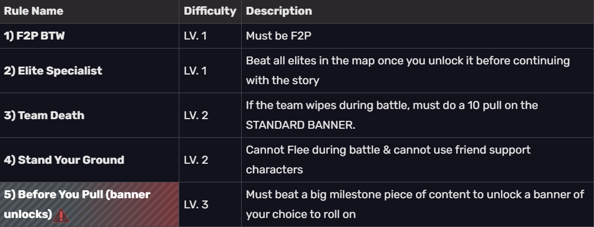

## Disclaimer
- These rules are generalized. If they do not cover certain edge cases, then feel free to address it however you would like to at your own discretion!
## MAIN RULE
- NO TANKS / NO HEALERS (If forced to use in trial, and no way to bypass, it's fine)
- NO Preservation or Abundance path for SU (you can select the blessings, but not the path)

## Other Rules
- for rule #5 milestones, check below

## Rule: 5) Before You Pull (Banner Unlock Milestones)

- once you go **"Post TL 60"**, all **"Pre TL 60"** milestones will still need to be completed, but they do NOT grant a banner unlock.
- **upon completion of a milestone:** one character OR weapon banner unlock of your choice (You CAN hoard banner unlocks as you beat each milestone)
- If you run out of pulls and die -> Nothing happens. You're just at 0 jades and broke kekw.

| Pre TL 60 (chars lv. 70)                                 | Post TL 60 (chars lv. 80)                                           | ANY TL                     |
| -------------------------------------------------------- | ------------------------------------------------------------------- | -------------------------- |
| 1) Unlock Swarm Disaster (Beat the first 5 worlds in SU) | 1) Defeat every Echo of War boss at the highest difficulty          | 1) Farm 1000 eagle pieces  |
| 2) Beat Forgotten Halls                                  | 2) Beat the memory of chaos                                         | 2) Obtain 500 Achievements |
| 3) Perfect 45 stars for Forgotten Halls                  | 3) Obtain 36 stars in the memory of chaos                           | 3) YOUR SUGGESTION!        |
| 4) Complete the Xianzhou Story                           | 4) Beat pure fiction                                                | 4) ??FINAL CHALLENGE??   |
| 5) Complete the Penacony Story                           | 5) Obtain 12 stars in pure fiction                                  |                            |
| 6) Beat Swarm Disaster Difficulty 4                      | 6) Perfect Clear Memory of Xianzhou 6                             |                            |
| 7) Beat Gold & Gears Difficulty 5                        | 7) Beat Swarm Disaster Difficulty 5                       |                            |
| 8) Beat the hardest difficulty in SU (9/9)               | 8) Beat Gold & Gears Difficulty 5 Conundrum lv 12 |                            |
| Freebie) Beat Gepard in SU world 3                                                         |                                                                     |                            |

